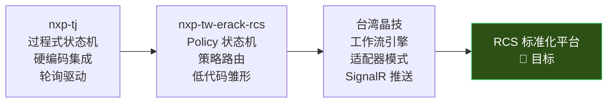
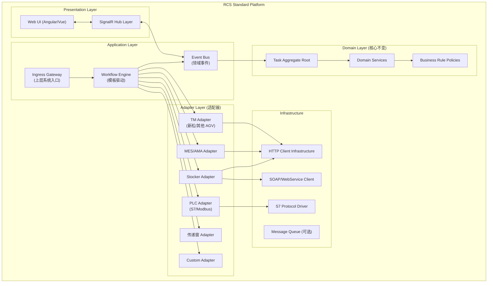

# RCS 系统标准化平台 — 深度分析与架构建议

## 一、三套系统现状对比分析

基于对 `nxp-tj`、`nxp-tw-erack-rcs`、`台湾晶技` 三个项目的完整代码研读，以下是核心维度对比：

### 1.1 架构 & 技术栈对比

| 维度 | nxp-tj (Molding_RCS) | nxp-tw-erack-rcs (Erack_RCS) | 台湾晶技 (RCS) |
|---|---|---|---|
| **框架** | .NET 8 + ABP | .NET 8 + ABP | .NET 10 + ABP v8.x |
| **前端** | Vue 3 + React（双版本） | Vue 3 (Soybean Admin) | Angular 19 |
| **分层** | DDD 标准分层 | DDD 标准分层 | DDD 标准分层 |
| **前后端通信** | 前端轮询 REST | 前端轮询 REST | **SignalR 推送** ✅ |

### 1.2 TM 交互代码对比（高度重复 ⚠️）

三个项目的 TM 交互代码**相似度 > 85%**：

| TM 交互点 | nxp-tj | nxp-tw-erack-rcs | 台湾晶技 |
|---|---|---|---|
| **下发路由** | `POST {BaseUrl}/task_add` | `POST api/v1/xinsong/task_add` | `POST {BaseUrl}/task_add` |
| **取消路由** | `POST {BaseUrl}/task_delete` | `POST api/v1/xinsong/task_delete` | `POST {BaseUrl}/task_delete` |
| **回调路由** | `/api/v1/xinsong/*` | `/api/v1/xinsong/*` | `/api/v1/xinsong/*` |
| **回调类型** | task_info, task_arrive_target, robot_permiss_start_action, task_finish | **完全相同** | **完全相同** |
| **OptionCode** | 位运算打包 TaskCode1/TaskCode2 | 位运算打包 TaskCode1/TaskCode2 | 由 PayloadBuilder 封装 |
| **实现方式** | `TaskService` 直接 HttpPost | `TaskService` 直接 HttpPost | `ITmClient` + `TmHttpClient` 适配器 ✅ |

> [!CAUTION]
> 每个新项目都在重复编写：TM HTTP 客户端、回调 Controller、OptionCode 位运算、任务状态映射。这是最大的重复浪费。

### 1.3 状态管理对比

| 维度 | nxp-tj | nxp-tw-erack-rcs | 台湾晶技 |
|---|---|---|---|
| **状态定义** | `TaskStatus` 枚举 (20+ 状态) | `TaskStatus` 枚举 (14 状态) | 无枚举，由工作流步骤驱动 ✅ |
| **状态流转** | 在 `ApiForTmService` 中过程式 if/switch | `ITaskWorkflowPolicy` + pattern matching | `TaskWorkflow` + JSON 步骤定义 ✅ |
| **扩展性** | 改代码 ❌ | 改 Policy 类 🔶 | 改 JSON 模板 ✅ |

### 1.4 第三方集成对比

| 集成对象 | nxp-tj | nxp-tw-erack-rcs | 台湾晶技 |
|---|---|---|---|
| **上层系统 (AMA/MES)** | `AMAAdapter` 直接 HTTP | `AMAAdapter` 直接 HTTP | `IMesReporter` 接口 + 策略实现 ✅ |
| **仓储 (Mica/STK)** | `MicaAdapter` 手写 SOAP XML | `StkcIntegrationService` REST | 无（仅 MES） |
| **PLC** | 自研 S7Client (Infrastructure) | S7.Net 库 + PLCEngine | 无 |
| **传递窗** | 无 | `WinIntegrationService` REST | 无 |
| **模拟/测试** | `IsMock` 开关 🔶 | 无模拟 ❌ | `SimulationTmClient` / `SimulationMesReporter` ✅ |

### 1.5 关键演进方向总结



---

## 二、RCS 标准化平台架构建议

### 2.1 总体架构：分层 + 插件化



---

### 2.2 模块一：统一适配器框架（Adapter Framework）

#### 设计理念

每个第三方系统视为一个 **Port**（端口），RCS 通过 **Adapter** 与之对接。适配器分为两个方向：

- **Outbound Adapter（出站）**：RCS 主动调用外部系统（下发任务、查询状态、报告完成）
- **Inbound Adapter（入站）**：外部系统回调 RCS（TM 回调、Stocker 释放通知）

#### 核心抽象

```csharp
// ==========================================
// 1. 统一适配器接口（所有第三方系统的共同契约）
// ==========================================

/// <summary>
/// 适配器生命周期标记接口
/// </summary>
public interface IExternalSystemAdapter : ITransientDependency
{
    /// <summary>适配器标识名称（如 "XinsongTm", "MicaStocker", "SiemensPlc"）</summary>
    string AdapterName { get; }
    
    /// <summary>健康检查 / 心跳</summary>
    Task<HealthCheckResult> CheckHealthAsync(CancellationToken ct = default);
}

/// <summary>
/// 出站适配器基类 — 发送请求到外部系统
/// 自带：重试策略、超时控制、交互日志、Mock 切换
/// </summary>
public abstract class OutboundAdapterBase<TOptions> : IExternalSystemAdapter
    where TOptions : AdapterOptions, new()
{
    protected readonly TOptions Options;
    protected readonly IHttpClientFactory HttpClientFactory;
    protected readonly IInteractionLogger InteractionLogger;
    
    public abstract string AdapterName { get; }
    
    /// <summary>统一的 HTTP 发送 + 日志 + 重试</summary>
    protected async Task<TResponse> SendAsync<TRequest, TResponse>(
        string endpoint, TRequest payload, CancellationToken ct = default)
    {
        if (Options.UseSimulation)
            return await SimulateAsync<TRequest, TResponse>(endpoint, payload, ct);
        
        // 1. 记录交互日志（请求）
        await InteractionLogger.LogRequestAsync(AdapterName, endpoint, payload);
        
        // 2. 带 Polly 重试策略的 HTTP 调用
        var response = await ExecuteWithRetryAsync(endpoint, payload, ct);
        
        // 3. 记录交互日志（响应）
        await InteractionLogger.LogResponseAsync(AdapterName, endpoint, response);
        
        return response;
    }
    
    /// <summary>子类覆写以提供 Mock 行为</summary>
    protected virtual Task<TResponse> SimulateAsync<TRequest, TResponse>(
        string endpoint, TRequest payload, CancellationToken ct = default)
        => Task.FromResult(default(TResponse)!);
}

/// <summary>
/// 适配器配置基类 — 每个适配器有独立的配置节
/// </summary>
public class AdapterOptions
{
    public string BaseUrl { get; set; } = "";
    public bool UseSimulation { get; set; } = false;
    public int TimeoutSeconds { get; set; } = 30;
    public int MaxRetries { get; set; } = 3;
}
```

#### TM 适配器标准化示例

```csharp
// ==========================================
// 2. TM 适配器 — 所有项目共用（核心共享包）
// ==========================================

public interface ITmAdapter : IExternalSystemAdapter
{
    Task<TmDispatchResult> DispatchTaskAsync(TmTaskPayload payload, CancellationToken ct = default);
    Task<bool> CancelTaskAsync(string taskSerial, CancellationToken ct = default);
    Task<bool> HeartBeatAsync(CancellationToken ct = default);
}

/// <summary>
/// 新松 TM 适配器实现 — 标准化后所有项目共用
/// </summary>
public class XinsongTmAdapter : OutboundAdapterBase<TmAdapterOptions>, ITmAdapter
{
    public override string AdapterName => "XinsongTm";
    
    public async Task<TmDispatchResult> DispatchTaskAsync(TmTaskPayload payload, CancellationToken ct)
    {
        return await SendAsync<TmTaskPayload, TmDispatchResult>("/task_add", payload, ct);
    }
    
    public async Task<bool> CancelTaskAsync(string taskSerial, CancellationToken ct)
    {
        var result = await SendAsync<object, TmResult>("/task_delete", 
            new { Task_Serial = taskSerial }, ct);
        return result.Success;
    }
}

/// <summary>
/// TM 回调信号统一转换器 — 将 HTTP 回调转为领域信号
/// </summary>
[Route("/api/v1/xinsong")]
public class TmCallbackController : AbpController
{
    private readonly IWorkflowEngine _workflowEngine;
    
    [HttpPost("task_arrive_target")]
    public async Task<TmCallbackResponse> OnArrived([FromBody] TmCallbackDto input)
    {
        // 统一转换为领域信号，交给工作流引擎处理
        var signal = TmSignalMapper.MapToSignal(input, TmEventType.Arrived);
        var result = await _workflowEngine.SignalAsync(input.Task_Serial, signal);
        return TmCallbackResponse.From(result);
    }
    
    [HttpPost("robot_permiss_start_action")]
    public async Task<TmCallbackResponse> OnPermitRequested([FromBody] TmCallbackDto input)
    {
        var signal = TmSignalMapper.MapToSignal(input, TmEventType.PermitRequested);
        var result = await _workflowEngine.SignalAsync(input.Task_Serial, signal);
        return TmCallbackResponse.From(result);
    }
    
    // ... task_info, task_finish 同理
}
```

#### OptionCode 生成器标准化

```csharp
/// <summary>
/// OptionCode 位运算生成器 — 从三个项目提取的公共逻辑
/// 不再每个项目重写一遍
/// </summary>
public class TmOptionCodeBuilder
{
    public (int TaskCode1, int TaskCode2) Build(OptionCodeParams param)
    {
        int code1 = 0;
        code1 |= (param.MachineIndex & 0xFFF) << 20;
        code1 |= (param.BoxType & 0xF) << 16;
        code1 |= (param.AgvLocationIndex & 0xFF) << 8;
        code1 |= param.CameraTemplateIndex & 0xFF;

        int code2 = 0;
        code2 |= (param.MachineNumber & 0xFFF) << 20;
        code2 |= (param.PGMark & 0xF) << 16;
        code2 |= (param.MachineLocationIndex & 0xFF) << 8;
        code2 |= param.DeviceType & 0xFF;

        return (code1, code2);
    }
}
```

#### 适配器注册（项目级配置）

```csharp
// 每个新项目只需配置：用哪些适配器 + 各自的连接参数
public class ProjectModule : AbpModule
{
    public override void ConfigureServices(ServiceConfigurationContext context)
    {
        // TM 适配器（所有项目都有）
        context.Services.AddAdapter<ITmAdapter, XinsongTmAdapter>(options =>
        {
            options.BaseUrl = "http://tm-server:8080/api/v1/xinsong";
            options.UseSimulation = false;
        });
        
        // MES 适配器（按需）
        context.Services.AddAdapter<IMesAdapter, RestMesAdapter>(options =>
        {
            options.BaseUrl = "http://mes-server/api";
        });
        
        // Stocker 适配器（按需 — 可以是 REST 的 STK，也可以是 SOAP 的 Mica）
        context.Services.AddAdapter<IStockerAdapter, MicaSoapStockerAdapter>(options =>
        {
            options.BaseUrl = "http://mica-server/ws";
        });
    }
}
```

---

### 2.3 模块二：模板驱动的工作流引擎（Workflow Engine）

#### 设计理念

从台湾晶技的 `TaskWorkflow` 演进，核心思想是：

> **任务的生命周期不再由硬编码的枚举状态机驱动，而是由可配置的 JSON 工作流模板定义。**

这样新项目不需要定义新的 `TaskStatus` 枚举，只需定义新的工作流模板。

#### 工作流模板 JSON Schema

```json
{
  "templateCode": "fetch_put_standard",
  "version": "1.0",
  "description": "标准取放料流程（单程 Fetch + Put）",
  "steps": [
    {
      "name": "dispatch",
      "activity": "TmDispatch",
      "config": { "includeOptionCode": true }
    },
    {
      "name": "wait_fetch_start",
      "wait": { "event": "TaskStarted", "leg": "Fetch" }
    },
    {
      "name": "wait_fetch_arrive",
      "wait": { "event": "Arrived", "leg": "Fetch" }
    },
    {
      "name": "fetch_device_interaction",
      "activity": "DeviceInteraction",
      "config": {
        "adapterType": "Stocker",
        "action": "RequestRelease",
        "timeout": 60
      }
    },
    {
      "name": "fetch_permit",
      "wait": { "event": "PermitRequested", "leg": "Fetch" },
      "activity": "TmReplyPermit"
    },
    {
      "name": "wait_fetch_finish",
      "wait": { "event": "Finished", "leg": "Fetch" }
    },
    {
      "name": "wait_put_arrive",
      "wait": { "event": "Arrived", "leg": "Put" }
    },
    {
      "name": "put_device_interaction",
      "activity": "DeviceInteraction",
      "config": {
        "adapterType": "PlcGate",
        "action": "OpenDoor",
        "waitForConfirm": true
      }
    },
    {
      "name": "put_permit",
      "wait": { "event": "PermitRequested", "leg": "Put" },
      "activity": "TmReplyPermit"
    },
    {
      "name": "wait_put_finish",
      "wait": { "event": "Finished", "leg": "Put" }
    },
    {
      "name": "complete",
      "activity": "ExecutionComplete",
      "config": { "reportToMes": true }
    }
  ]
}
```

#### 标准 Activity（可复用 + 可扩展）

内置的标准 Activity 覆盖 80% 以上的场景：

| Activity 名称 | 用途 | 适用场景 |
|---|---|---|
| `TmDispatch` | 构建 Payload 并调用 `ITmAdapter.DispatchTaskAsync` | 所有项目 |
| `TmReplyPermit` | 回复 TM 允许/拒绝执行动作 | 所有项目 |
| `TmCancel` | 调用 `ITmAdapter.CancelTaskAsync` | 所有项目 |
| `DeviceInteraction` | 通用设备交互（通过适配器名路由到对应适配器） | Stocker, PLC, 传递窗 |
| `MesReport` | 向上层系统报告任务结果 | AMA, MES |
| `PlcReadWrite` | 读写 PLC 寄存器/DB 块 | PLC 联动场景 |
| `ConditionalBranch` | 根据条件跳转到不同步骤 | 需要分支逻辑的流程 |
| `ParallelWait` | 等待多个信号全部到达 | 多车协同 |
| `Delay` | 等待指定时间 | 设备冷却、安全间隔 |
| `ExecutionComplete` | 标记任务完成，触发 MES 回报 | 所有项目 |
| `HttpCall` | 通用 HTTP 调用（配置化） | 新的第三方集成快速接入 |

项目特有的 Activity 只需实现 `IWorkflowActivity` 接口：

```csharp
/// <summary>
/// 项目自定义 Activity 示例 — Mica Stocker 出库
/// </summary>
public class MicaStockOutActivity : IWorkflowActivity
{
    public string Name => "MicaStockOut";
    
    private readonly IStockerAdapter _stocker;
    
    public async Task ExecuteAsync(ActivityContext ctx, CancellationToken ct)
    {
        var eqpName = ctx.Config.GetString("eqpName");
        var materialId = ctx.Task.ContainerId;
        
        await _stocker.RequestStockOutAsync(eqpName, materialId, ct);
        ctx.Task.SetMetadata("StockOutRequested", true);
    }
}
```

#### 模板选择策略

```csharp
/// <summary>
/// 根据业务规则自动选择工作流模板
/// 每个项目配置自己的选择规则
/// </summary>
public interface ITemplateSelectionStrategy
{
    Task<string> SelectTemplateCodeAsync(TaskCreationContext ctx, CancellationToken ct);
}

// 示例：根据起止点设备类型选模板
public class RouteBasedTemplateSelector : ITemplateSelectionStrategy
{
    public Task<string> SelectTemplateCodeAsync(TaskCreationContext ctx, CancellationToken ct)
    {
        var templateCode = (ctx.SourceType, ctx.DestType) switch
        {
            (DeviceType.Stocker, DeviceType.Equipment) => "stocker_to_equipment",
            (DeviceType.Equipment, DeviceType.Stocker) => "equipment_to_stocker",
            (DeviceType.Stocker, DeviceType.PassWindow) => "stocker_to_window",
            _ => "fetch_put_standard"
        };
        return Task.FromResult(templateCode);
    }
}
```

---

### 2.4 模块三：事件驱动架构（Event-Driven Architecture）

#### 为什么要引入事件驱动

当前三个项目的问题：

| 问题 | 现状 | 改进 |
|---|---|---|
| **前端状态同步** | nxp-tj/erack 轮询 REST | SignalR 实时推送 |
| **跨模块耦合** | 任务完成后直接调 MES 报告 | 发布 `TaskCompletedEvent`，MES 模块订阅 |
| **PLC 状态变化** | 定时轮询 PLC | PLC 变化 → 发布事件 → 工作流响应 |
| **日志/审计** | 散落在各 Service 中 | 统一订阅事件写审计日志 |

#### 事件总线设计

```csharp
// ==========================================
// 领域事件定义（Domain.Shared 层）
// ==========================================

/// <summary>所有 RCS 领域事件的基类</summary>
public abstract record RcsEvent
{
    public string EventId { get; init; } = Guid.NewGuid().ToString();
    public DateTime OccurredAt { get; init; } = DateTime.UtcNow;
    public string? TaskId { get; init; }
}

// 工作流事件
public record TaskCreatedEvent(string TaskId, string TemplateCode) : RcsEvent;
public record TaskStepAdvancedEvent(string TaskId, int StepIndex, string StepName) : RcsEvent;
public record TaskCompletedEvent(string TaskId, TaskOutcome Outcome) : RcsEvent;
public record TaskCancelledEvent(string TaskId, string Reason) : RcsEvent;

// TM 交互事件
public record TmTaskDispatchedEvent(string TaskId, string TmSerial) : RcsEvent;
public record TmCallbackReceivedEvent(string TaskId, string EventType, string Leg) : RcsEvent;

// 设备事件
public record PlcSignalChangedEvent(string PlcName, string TagName, object OldValue, object NewValue) : RcsEvent;
public record StockerReleaseEvent(string StockerId, string MaterialId) : RcsEvent;

// ==========================================
// 事件处理器示例
// ==========================================

/// <summary>
/// MES 自动回报 — 订阅任务完成事件
/// 解耦：工作流引擎不需要知道 MES 的存在
/// </summary>
public class MesAutoReportHandler : ILocalEventHandler<TaskCompletedEvent>, ITransientDependency
{
    private readonly IMesAdapter _mesAdapter;
    
    public async Task HandleEventAsync(TaskCompletedEvent evt)
    {
        if (evt.Outcome == TaskOutcome.Success)
        {
            await _mesAdapter.ReportCompletionAsync(evt.TaskId);
        }
    }
}

/// <summary>
/// 审计日志 — 订阅所有 RCS 事件
/// </summary>
public class EventAuditLogHandler : 
    ILocalEventHandler<TaskStepAdvancedEvent>,
    ILocalEventHandler<TmCallbackReceivedEvent>,
    ITransientDependency
{
    public async Task HandleEventAsync(TaskStepAdvancedEvent evt)
    {
        await LogAsync("WorkflowStep", evt);
    }
    
    public async Task HandleEventAsync(TmCallbackReceivedEvent evt)
    {
        await LogAsync("TmCallback", evt);
    }
}
```

---

### 2.5 模块四：SignalR 实时通信标准化

#### 适用场景分析

| 场景 | 是否适用 SignalR | 理由 |
|---|---|---|
| **任务状态变化推送** | ✅ 强烈推荐 | 高频变化，轮询浪费资源，用户需实时看到 AGV 状态 |
| **PLC 信号状态面板** | ✅ 推荐 | PLC 信号变化需要秒级展示 |
| **告警通知** | ✅ 推荐 | 告警必须即时触达 |
| **Stocker 出库进度** | ✅ 推荐 | 用户等待出库过程需要实时反馈 |
| **基础数据 CRUD** | ❌ 不需要 | 低频操作，REST 即可 |
| **报表查询** | ❌ 不需要 | 读取操作，无需推送 |

#### 标准化 Hub 设计

```csharp
// ==========================================
// 统一 SignalR Hub（标准平台内置）
// ==========================================

[Authorize]
public class RcsHub : Hub
{
    public const string HubPath = "/signalr-hubs/rcs";
    
    // 客户端可订阅的频道
    public const string TaskStatusChanged = "TaskStatusChanged";
    public const string AlarmRaised = "AlarmRaised";
    public const string PlcSignalUpdated = "PlcSignalUpdated";
    public const string SystemNotification = "SystemNotification";
    
    // 客户端可加入特定分组（按设备区域、任务类型等）
    public async Task JoinGroup(string groupName)
    {
        await Groups.AddToGroupAsync(Context.ConnectionId, groupName);
    }
}

/// <summary>
/// SignalR 通知服务 — 由事件处理器自动触发
/// </summary>
public class SignalRNotifier : 
    ILocalEventHandler<TaskStepAdvancedEvent>,
    ILocalEventHandler<PlcSignalChangedEvent>,
    ITransientDependency
{
    private readonly IHubContext<RcsHub> _hub;
    
    public async Task HandleEventAsync(TaskStepAdvancedEvent evt)
    {
        await _hub.Clients.All.SendAsync(RcsHub.TaskStatusChanged, new
        {
            evt.TaskId,
            evt.StepIndex,
            evt.StepName,
            evt.OccurredAt
        });
    }
    
    public async Task HandleEventAsync(PlcSignalChangedEvent evt)
    {
        await _hub.Clients.Group($"plc:{evt.PlcName}")
            .SendAsync(RcsHub.PlcSignalUpdated, new
            {
                evt.PlcName,
                evt.TagName,
                evt.NewValue,
                evt.OccurredAt
            });
    }
}
```

#### 前端标准化（参考台湾晶技的 500ms 节流方案）

```typescript
// 标准前端 SignalR 服务 — 所有 RCS 项目共用
@Injectable({ providedIn: 'root' })
export class RcsHubService {
  // 500ms 缓冲聚合，防止高频更新导致 UI 卡顿
  readonly taskUpdates$ = this.rawTaskChanges$.pipe(
    bufferTime(500),
    filter(batch => batch.length > 0),
    map(batch => {
      const latest = new Map<string, TaskStatusDto>();
      for (const item of batch) latest.set(item.taskId, item);
      return [...latest.values()];
    }),
    shareReplay({ bufferSize: 1, refCount: true })
  );
}
```

---

### 2.6 模块五：低代码 / 配置化能力

#### 目标：新项目 80% 的功能通过配置完成，20% 通过代码扩展

```
┌─────────────────────────────────────────────────────────┐
│                    新项目交付清单                          │
├─────────────────────────────────────────────────────────┤
│  ✅ 配置化（无需写代码）                                    │
│  ├── appsettings.json: 适配器连接参数                      │
│  ├── workflow_templates.json: 工作流模板定义                │
│  ├── station_map.json: 站点 ↔ AGV 点位映射                │
│  ├── route_rules.json: 路由规则（起点类型→终点类型→模板）     │
│  └── plc_tags.json: PLC 点表配置                          │
│                                                         │
│  🔧 少量代码（项目特有逻辑）                                │
│  ├── 自定义 WorkflowActivity（特殊设备交互）               │
│  ├── 自定义 TemplateSelector（特殊路由规则）                │
│  └── 自定义 Adapter（非标第三方系统）                       │
│                                                         │
│  📦 平台内置（零代码）                                      │
│  ├── TM 适配器 + 回调 Controller                          │
│  ├── 工作流引擎 + 标准 Activity                            │
│  ├── SignalR Hub + 前端组件                               │
│  ├── PLC 引擎 (S7/Modbus)                                │
│  ├── 交互日志 + 审计                                      │
│  ├── 任务管理 UI（CRUD + 状态看板）                         │
│  └── 基础数据管理 UI（站点、点位、设备）                      │
└─────────────────────────────────────────────────────────┘
```

#### 配置驱动示例：一个新项目的 `appsettings.json`

```json
{
  "RcsPlatform": {
    "ProjectCode": "NXP-SH-Phase3",
    
    "Adapters": {
      "Tm": {
        "Type": "XinsongTm",
        "BaseUrl": "http://192.168.1.100:8080/api/v1/xinsong",
        "UseSimulation": false,
        "MaxRetries": 3
      },
      "Mes": {
        "Type": "RestMes",
        "BaseUrl": "http://mes-server/api/rcs",
        "UseSimulation": false
      },
      "Stocker": {
        "Type": "MicaSoap",
        "BaseUrl": "http://mica-server/ws/StockService",
        "UseSimulation": true
      },
      "Plc": {
        "Type": "SiemensS7",
        "Connections": [
          { "Name": "PLC-Line1", "Ip": "192.168.2.10", "Rack": 0, "Slot": 1, "CpuType": "S71500" },
          { "Name": "PLC-Line2", "Ip": "192.168.2.11", "Rack": 0, "Slot": 1, "CpuType": "S71200" }
        ]
      }
    },
    
    "Workflows": {
      "TemplateSource": "Database",
      "SeedFromFile": "workflow_templates.json"
    },
    
    "SignalR": {
      "Enabled": true,
      "ThrottleMs": 500
    }
  }
}
```

---

### 2.7 NuGet 包划分建议

```
Siasun.Rcs.Platform.Shared          → 枚举、DTO、事件定义、接口契约
Siasun.Rcs.Platform.Domain          → TaskDo、工作流引擎、Activity 接口
Siasun.Rcs.Platform.Application     → 标准 AppService、TM 回调处理
Siasun.Rcs.Platform.Adapters.Tm     → 新松 TM 适配器（HTTP Client + 回调 Controller）
Siasun.Rcs.Platform.Adapters.Plc    → S7/Modbus PLC 适配器
Siasun.Rcs.Platform.Adapters.Mes    → MES/AMA 通用适配器
Siasun.Rcs.Platform.SignalR         → Hub + 通知器
Siasun.Rcs.Platform.EntityFramework → DbContext 基类、通用 Migration
Siasun.Rcs.Platform.HttpApi         → 通用 Controller 基类
Siasun.Rcs.Platform.UI.Components   → 前端通用组件（任务看板、PLC 面板等）
```

每个新项目只需：
```xml
<PackageReference Include="Siasun.Rcs.Platform.Domain" Version="1.*" />
<PackageReference Include="Siasun.Rcs.Platform.Adapters.Tm" Version="1.*" />
<!-- 按需引入其他适配器包 -->
```

---

## 三、从现有项目到标准平台的演进路线

### Phase 1：提取共享内核（2-3 周）
- [ ] 从三个项目中提取 TM 交互代码 → `Siasun.Rcs.Platform.Adapters.Tm`
- [ ] 统一 OptionCode 位运算 → `TmOptionCodeBuilder`
- [ ] 统一 TM 回调 Controller → 标准 `TmCallbackController`
- [ ] 建立适配器基类 → `OutboundAdapterBase<T>`

### Phase 2：工作流引擎标准化（2-3 周）
- [ ] 以台湾晶技的 `TaskWorkflow` 为基础演进
- [ ] 建立标准 Activity 库（TmDispatch, TmReplyPermit, DeviceInteraction, ExecutionComplete）
- [ ] 实现 JSON 模板的数据库存储 + 种子数据机制
- [ ] 实现模板选择策略接口

### Phase 3：事件驱动 + SignalR（1-2 周）
- [ ] 定义标准领域事件集
- [ ] 在工作流引擎中发布事件
- [ ] 实现 SignalR Hub + 事件→推送桥接
- [ ] 前端 SignalR 服务组件化

### Phase 4：配置化 & 低代码（2-3 周）
- [ ] 站点映射配置化
- [ ] PLC 点表配置化（参考 erack 的 PLCTag 模型）
- [ ] 路由规则配置化
- [ ] 工作流模板 UI 编辑器（可视化拖拽步骤，可后期做）

### Phase 5：验证 & 迁移（2-3 周）
- [ ] 用标准平台重新搭建一个最简项目验证
- [ ] 逐步将 nxp-tw-erack-rcs 迁移到平台（最新、最完善）
- [ ] 文档 & 开发者指南

---

## 四、关键设计决策建议

> [!IMPORTANT]
> ### 1. 状态枚举 vs 工作流步骤
> **建议保留一个精简的顶层 `TaskLifecycle` 枚举**（如 `Created → Running → Waiting → Succeeded → Failed → Cancelled`），用于 UI 展示和数据库查询。**细粒度的状态流转由工作流步骤 `StepIndex + StepName` 驱动**，不再为每个项目定义 20+ 状态的枚举。

> [!IMPORTANT]
> ### 2. ABP 本地事件总线 vs 分布式消息队列
> **建议初期使用 ABP 内置的本地事件总线**（`ILocalEventBus`），足够满足单体部署需求。未来如果需要微服务拆分，可无缝切换到 RabbitMQ/Kafka（ABP 的 `IDistributedEventBus` 支持）。

> [!IMPORTANT]
> ### 3. 前端框架统一
> 当前三个项目分别使用 Vue 3、React、Angular。**建议标准平台选定一个前端框架**，将通用 UI 组件（任务看板、PLC 面板、工作流可视化）封装为该框架的组件库。SignalR 的连接管理层可以是框架无关的纯 TypeScript 包。

> [!WARNING]
> ### 4. 不要过度抽象
> 适配器模式的边界要清晰：**只抽象「协议层」和「数据转换层」，不要试图抽象「业务逻辑」**。比如 TM 的 HTTP 通信可以标准化，但每个项目的 OptionCode 参数映射规则（哪个机台对应哪个 boxType）应该是项目配置，不是平台代码。

> [!TIP]
> ### 5. PLC 交互建议采用「点表 + 引擎」模式
> 参考 nxp-tw-erack-rcs 的 PLCTag/PLCGroup 模型，将 PLC 点位映射配置化（DB 块号、偏移量、数据类型），由通用 PLC 引擎负责读写和变化检测。项目只需维护点表配置，不需要写 PLC 读写代码。
